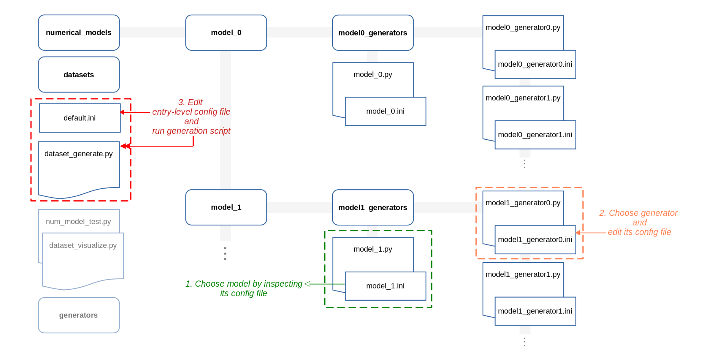
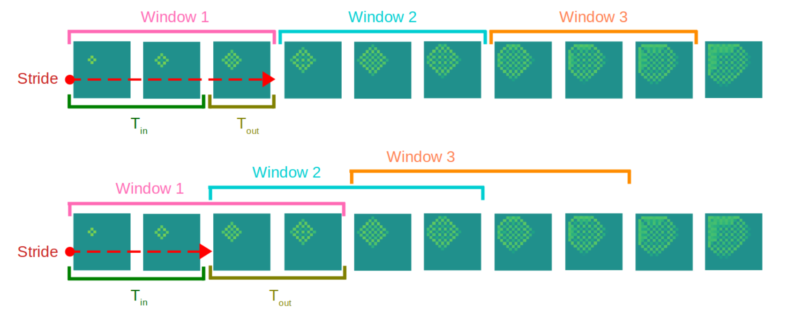

# Neuralacoustics: A Deep Learning Framework For Musical Acoustics Simulations 

Neuralacoustics is a framework designed for the generation of numerical musical acoustics datasets and the training/benchmarking of acoustics neural operators.


## Project Description

The Neuralacoustics project aims to bridge the domains of musical acoustics and deep learning, by providing common practices including shared datasets, benchmarks, as well as general tools to **help researchers categorize, manage and employ acoustics data for training and inference**.

The framework is composed of two pipelines:

1. **Dataset generation**
2. **Deep learning training and evaluation**

### Dataset Generation

The dataset generation pipeline stems from the necessity to generate musical acoustics datasets that could be easily employed in deep learning. It consists of a collection of Python implementations of numerical models of musical instruments, embedded in a modular structure that facilitates extensibility and allows for the application of a model-independent workflow. 

Following are the three main components for dataset generation:

1. Solvers: Solvers implement numerical solutions of highly parametric PDE systems. They are stored in the `solvers` sub-directory, organized by the actual numerical method employed.

2. Numerical models: Numerical models simulate specific musical instruments, by loading solvers with imposed constraints and incorporating excitation algorithms. They are stored in the `numerical_models` sub-directory.

3. Dataset generators: They generate datasets for training with diverse parameter inputs to specific numerical models and solvers. Each numerical model has their corresponding dataset generators in its directory, stored in the `dataset_generators` sub-directory.

<!--
The framework includes a dataset generation script in the root directory, **`dataset_generate.py`**, that allows for the correct use of dataset generators, numerical models and solvers. It collects all the simulation data computed by a chosen generator script into an actual dataset. Each dataset entry represent a complete simulation, associated to a specific set of parameters. 

The dataset generation script is accompanied by a configuration script also in the root directory, **`default.ini`**. The configuration script can be used to specify a range of parameters for dataset generation, including but not liminited to: which dataset generator to run, the directory where the dataset will be saved, as well as the device where the code will run. 
-->

Following are the features of the dataset generation pipeline:

#### Modular design
The three components co-function in a nested manner: during simulation the dataset generators incorporates numerical models, which further load their corresponding solvers. Moreover, each numerical model and each dataset generator is composed of an implementation `.py` script and a configuration `.ini` file. The configuration file specifies any controllable parameters with respect to the solver, the numerical model, or the dataset generator. When generating a dataset, the user only needs to modify the configuration files to make adjustments, and then use a top-level script under the root directory to run the process.

#### High portability
 
* The dataset generation script outputs MAT files (“.mat” extension), a binary file standard introduced in MATLAB5 to store workspace variables. We chose this specific format because it is often considered as one of the de-facto standards, and it is supported by a large variety of languages and frameworks used in machine learning —- including Javascript, C/C++ and Python/Pytorch/Tensorflow.
* The entry-level dataset generation script is capable of splitting the dataset into several “chunks”, each represented by an individual MAT-file. This is to avoid exceeding the maximum size supported by the native file system where the code runs.

#### High replicability
<!--* **The resulting dataset is structured as a directory,** containing all the chunk files sorted by order of creation. Eventually, when a dataset is loaded in memory (to train a network or to visualize its content), all the chunk files are transparently combined together back into a single dataset.-->
The dataset generation script compiles a log file for reproducing experiments. It is hosted in the dataset folder and contains a summary of the content of the dataset. Additionally, the log file reports the details of the generation process, including all the parameters of the employed generator script, as well as those of the numerical model the generator is associated with. Thanks to this structure, any log file can function as a unique configuration file, that when passed to the entry-level script (in place of default.ini) sets both generator’s and model’s parameters, and allows users to automatically obtain an exact copy of the original dataset.

#### Easy inspection
The pipeline supports visualization of generated data. The user can either use specialized scripts (`num_model_test.py` and `dataset_visualize.py`) or the default configuration script to visualize the domain states calculated by numerical models.

#### Flexible data loading
Generated data could be extracted and loaded through a windowing alglorithm. The windowing algorithm is part of our datapoint extraction tool, which retrieves data points by means of repeatedly windowing the entries’ time series (collecting a data point per window). This windowing mechanism not only allows various options when visualizing a dataset, but also supports the customizability of dataset construction during the training of neural operators.

### Training and Evaluation
The Neuralacoustics framework also aims to facilitate the design of neural operators capable of solving acoustics PDEs. Currently, this part of the framework is comparatively less developed than the dataset generation pipeline.


## Get Started

### Installation

1. Clone the project from the source:

	```
	git clone git@github.com:<anonymized>/neuralacoustics.git
	```

2. Download and install Anaconda

3. Create and activate new environment:

	```
	conda create --name YOUR_ENV python=3.7
	conda activate YOUR_ENV
	``` 
  
4. Install required libraries in environment:
  
	```
	conda install pytorch torchvision torchaudio cpuonly -c pytorch 
	  
	conda install scikit-learn 
	   
	conda install scipy 
	  
	conda install matplotlib 
	  
	conda install h5py 
	    
	conda install -c conda-forge tensorboard
	```
	    
	(NOTE: missing CUDA installation, this will run code on CPU only)
	
	The argunment "-c" is the channel (i.e., repo). If any library is not available from Anaconda or from the specified channel, try with:
	
	```
	pip install LIB_NAME
	```

5. Optional libraries that need to be installed with pip:

	```
	pip install fvcore
	```

### Dataset generation

The following figure depicts the complete dataset generation workflow (folder names are in bold):



1. Locate a numerical model that represents the specific instrument the dataset will exemplify. Descriptions and data available in the models’ configuration files are in most cases enough to select the most appropriate script. 
2. Choose a dataset generator that samples the numerical model of interest. In this step, the user shall adjust the parameters exposed in the generator’s configuration file, to make sure that the sampling procedure will result in data that well represent the instrument and its specific playing configuration. 
3. Edit the configuration file in the root directory with the path to the chosen generator, along with the other structural parameters. 

At this point, the user can run the `dataset generate.py` with:

```
python dataset_generate.py --config /path/to/YOUR_CONFIG_FILE
```

* The `config` argument is optional: If it is not specified, the generation script just reads `default.ini`. Only section "dataset_generation" of the configuration file `default.ini` will be parsed. The resulting dataset will be computed and stored according to the requested settings.
* The name of the dataset will be "dataset_N", where N is the number of dataset already present in the target directory.

<!--Note that every numerical model is associated to a config file (MODEL_NAME.ini) too, found in the numerical model's folder. Make sure that the values under section "parameters" are set correctly, for they will determine the behavior of the model as well as the content of the resulting dataset.-->
	    
<!--The script will generate in the path specified in config file a folder with the new dataset (typically split in chunks—see "chunks" entry in default.ini), along with a log file that contains only info relevant to the generation of the dataset (e.g., number of entries, batch size, details of the numerical model).-->
	

### Data visualization

There are three methods to visualize the calculated states by numerical models:

1. Run `python num_model_test.py` under the root directory to simulate and visualize data in real time. Through section "numerical_model_test" in `default.ini`, the user can choose the numerical model to test (parameter `numerical_model`) and how long every “frame” of the output animation lasts (parameter `pause_sec`). If the `numerical_model_config` parameter is set as `default`, the actual parameters of the model are loaded from its configuration file, allowing for quick tuning and facilitating the comparison between different playing configurations. 

2. Run `python dataset_visualize.py` also under the root directory to load and visualize data from an existing dataset. Through section "dataset_visualization" in `default.ini`, the user can specify the parameters for the windowing mechanism and the exact data entries to visualize (parameters `first_datapoint` and `n_visualize`).

3. Ser the `dryrun` parameter is set to to 1 in section "dataset_generation" of `default.ini`, and run the `dataset_generate.py` script. It will directly compute a single dataset entry (i.e, a single simulation), and visualize it without saving it.

Here's an example of data visualization:
<!--TODO-->

### Data extraction with windowing

<!--It is necessary to emphasize the difference between an “entry” within the dataset and a “data point” extracted from it: Each entry in a Neuralacoustics dataset consists of a time series, representing the simulation of an instrument over a certain number of time steps; in the most general sense, a Neuralacoustics data point can be any sub-series of consecutive time steps found in a dataset entry. -->

The mechanism of the windowing algorithm is depicted in the figure below, where the same dataset entry is processed via two different sets of parameters, to exemplify the extraction of different data.



The main windowing parameters for the windowing algorithm are: the size of the windows (`window_size`), the stride applied between consecutive windows (`window_stride`), and the dataset entry where the windows are applied (`first_datapoint`). To simply visualize the full simulations within each entry, the user can set either the size of the window equal to the number of time steps of each entry, or the stride equal to the size of the window.

When used to collate a training set, the extraction tool keeps applying the windows across each entry of the dataset, until the number of data points requested by the user is obtained. 


